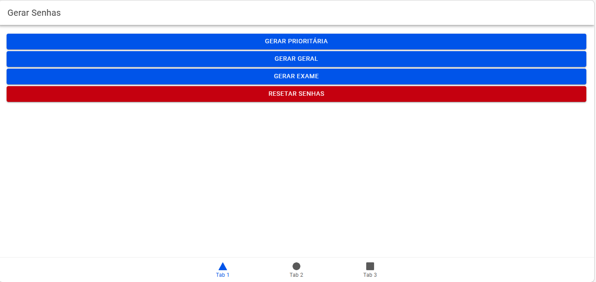
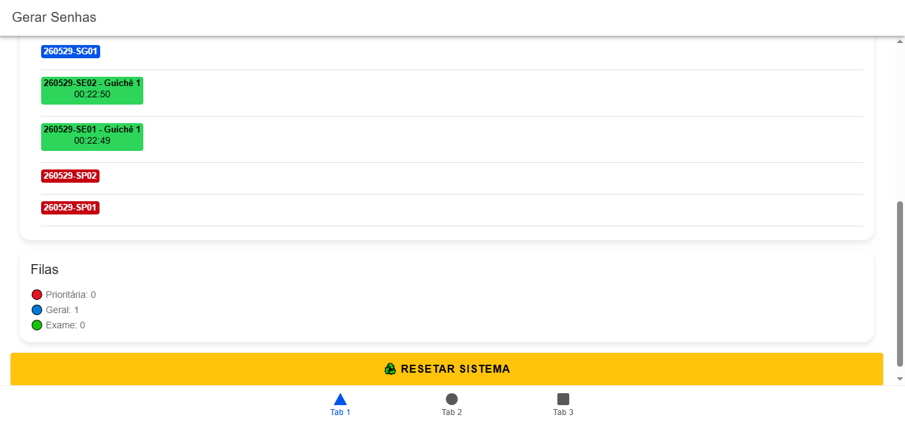
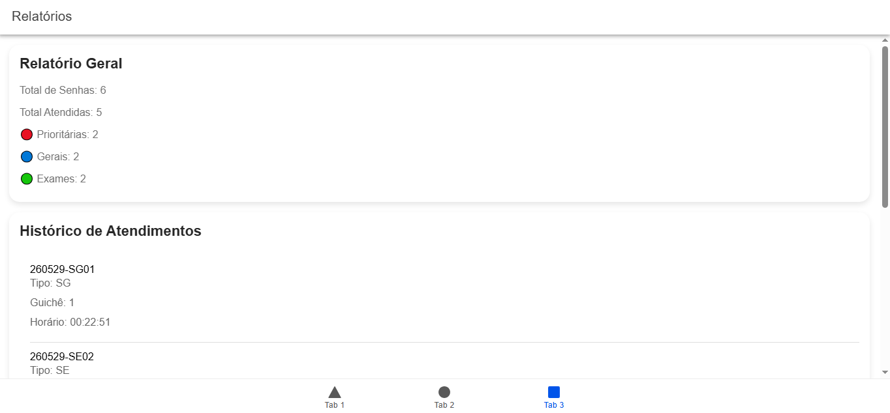

# MobileTicketsIonic

Projeto Mobile desenvolvido em **Ionic + Angular**, com template de **Tabs** e integração **Capacitor**.

## 📌 Objetivo

Praticar os conteúdos abordados em sala de aula, aplicando conceitos de Ionic, Angular, rotas, componentes, diretivas e pipes, além de fortalecer o portfólio do aluno.

## ⚙️ Funcionalidades

- Login de usuário
- Visualização de tickets disponíveis
- Detalhes do ticket selecionado
- Navegação entre abas (Tabs)
- Uso de Pipes e Diretivas personalizadas

## 🖼️ Screenshots

  
  
  

> ⚠️ Coloque suas próprias capturas de tela na pasta `screenshots`.

## 🛠️ Tecnologias Utilizadas

- Ionic  
- Angular  
- Capacitor  
- HTML, CSS, TypeScript  

## 💻 Como Rodar o Projeto

1. Instale as dependências:

```bash
npm install